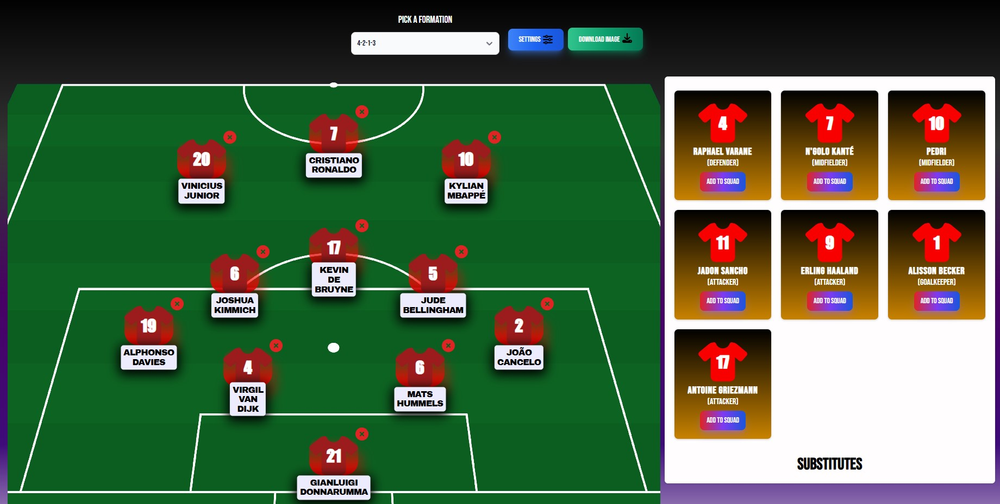
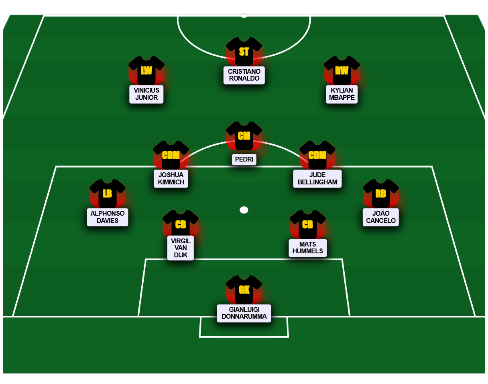

# React squad builder

## About the library
The **"react-squad-builder"** library simplifies the creation of a football starting XI. It offers a pitch featuring players and a bench. Users can easily add or swap players on the pitch. Simply include the component and define the players, the component handles the rest.

## Functions:
* various formations,
* customizable jersey color,
* customizable jersey text color,
* customizable jersey  text,
* saving of the starting XI as an image,
* easy to add additional translations




## Usage
### Define the players

You can define players as JSON, for example:
```js
{
    "id": 13,
    "positionType": "defender",
    "alternativePositions": "",
    "name": "Virgil van Dijk",
    "shirtNumber": 4
},
```
<hr>

### **Positions**
There are *4 types* of positions defined: 
1. goalkeeper
2. defender
3. midfielder
4. attacker

**positionType** must be one of the four above, this will be showed as the player's position.<br>
There are players in the world of football who can be used in different areas of the field, such as Joshua Kimmich. in this case, we would probably like to be able to put him in several areas of the pitch. This can be done with "**alternativePositions**", where you can list even more of the 4 position types just listed, separated by ",", "/" or ";". For example: 
```js
{
    "id": 1,
    "positionType": "defender",
    "alternativePositions": "midfielder/defender",
    "name": "Joshua Kimmich",
    "shirtNumber": 4
},
```

#### ***Important:***
* The **players id's have to be unique**, which means each player needs to have a different id
* The **player name should not be too long**, because it will spoil the user experience. It is recommended to write only the player's first and last name or abbreviate his name, for example, Mathys H. Tel.
* Shirt numbers must not be unique

<br>

### Import the library, in the file you want to use the component
```jsx
import SquadBuilder from './components/SquadBuilder'
```

### Define the players you want to include
```jsx
const players = [
    {
      "id": 1,                      // Id of the player, has to be unique
      "positionType": "goalkeeper", // The type of the player's position
                                    //(goalkeeper/defender/midfielder/attacker)
      "alternativePositions": "",   // additional positions can be listed separated by ", "/" or ";"
      "name": "Gianluigi Donnarumma",
      "shirtNumber": 21
    },
    ...
]
```

### In the same file define the component
```jsx
<SquadBuilder players={players} />
```

### The whole file
```jsx
import SquadBuilder from './components/SquadBuilder'

const YourComponent = () => {

  const players = [
    {
      "id": 1,
      "positionType": "goalkeeper",
      "alternativePositions": "",
      "name": "Gianluigi Donnarumma",
      "shirtNumber": 21
    },
    ...
  ]
  return (
    <SquadBuilder players={players} />
  )
}
export default YourComponent
```